# 🛒 SCATCH MART

<div align="center">

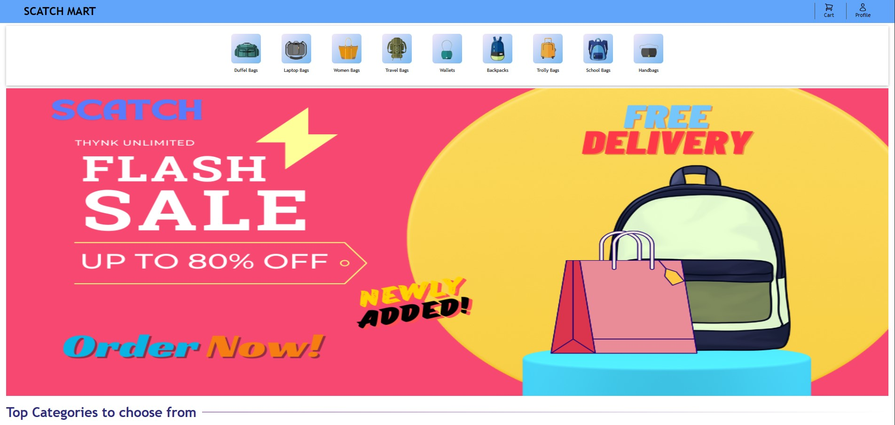
<!-- Add your project banner/logo here -->

**A Modern Full-Stack E-Commerce Platform Built with MERN Stack**

[](https://reactjs.org/)
[](https://vitejs.dev/)
[](https://tailwindcss.com/)
[](https://nodejs.org/)
[](./LICENSE)

[Live Demo](https://scatch-mart.netlify.app/) • [Documentation](https://docs.your-project.com) • [Report Bug](https://github.com/EgaleCoder/SCATCH_MART/issues) • [Request Feature](https://github.com/EgaleCoder/SCATCH_MART/issues)

</div>

---

## 📋 Table of Contents

- [Overview](#-overview)
- [Screenshots](#-screenshots)
- [Features](#-features)
- [Tech Stack](#-tech-stack)
- [Architecture](#-architecture)
- [Getting Started](#-getting-started)
- [Project Structure](#-project-structure)
- [Environment Variables](#-environment-variables)
- [Usage Guide](#-usage-guide)
- [API Documentation](#-api-documentation)
- [Deployment](#-deployment)
- [Roadmap](#-roadmap)
- [Contributing](#-contributing)
- [License](#-license)
- [Contact](#-contact)

---

## 🎯 Overview

**SCATCH MART** is a cutting-edge, full-featured e-commerce platform built with the MERN stack (MongoDB, Express.js, React, Node.js). This modern web application delivers a seamless online shopping experience with secure authentication, advanced product management, dynamic cart functionality, and a comprehensive admin panel.

The platform features a responsive, mobile-first design built with React 19, Vite, and Tailwind CSS v4, ensuring optimal performance and user experience across all devices.

### 🌟 Why SCATCH MART?

- **Modern Architecture**: Built with React 19 and latest web technologies
- **Performance First**: Optimized with code splitting, lazy loading, and skeleton screens
- **Secure**: JWT-based authentication with role-based access control
- **Scalable**: Modular design with Context API and reducer pattern
- **Developer Friendly**: Clean code, ESLint configuration, and comprehensive documentation

---

## 📸 Screenshots

### 🏠 Landing Page & Home


<!-- Add screenshot of your landing page -->

*Modern, responsive landing page with hero section and featured products*

---

### 🛍️ Product Catalog

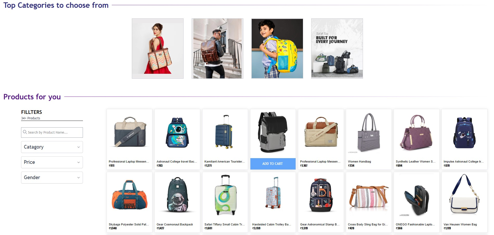
<!-- Add screenshot of product listing page -->

*Advanced product filtering and search with category-based navigation*

---

### 📦 Product Details

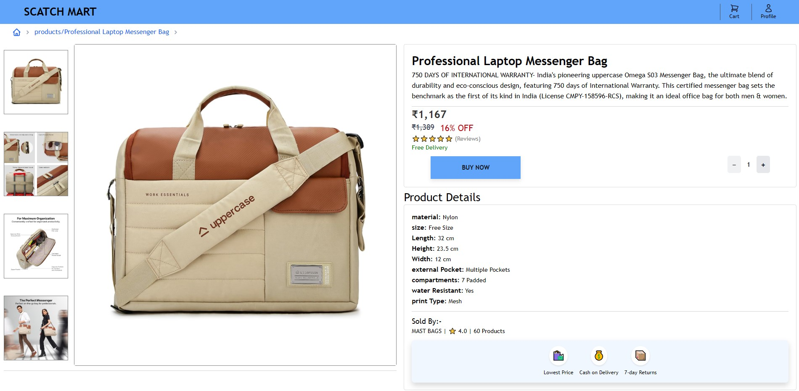
<!-- Add screenshot of product detail page -->

*Detailed product view with image gallery, specifications, and related products*

---

### 🛒 Shopping Cart

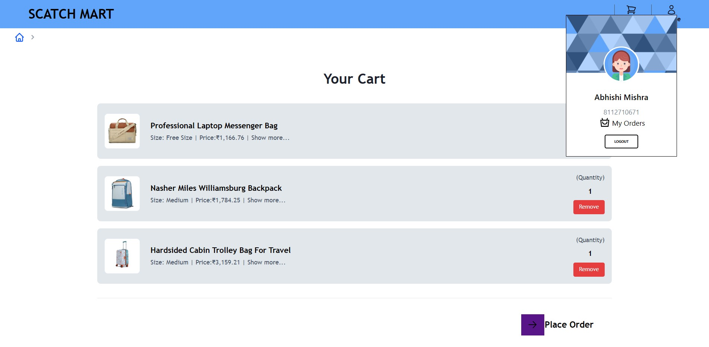
<!-- Add screenshot of shopping cart page -->

*Dynamic cart with quantity management and real-time price calculations*

---

### 👤 User Authentication

<table>
  <tr>
    <td width="50%">
      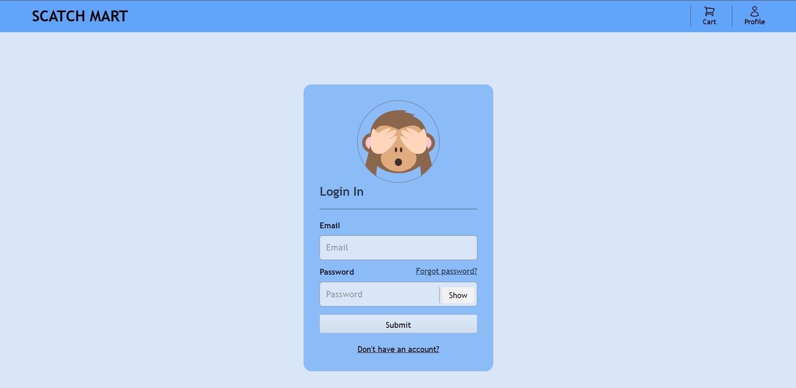
      <p align="center"><em>User Login</em></p>
    </td>
    <td width="50%">
      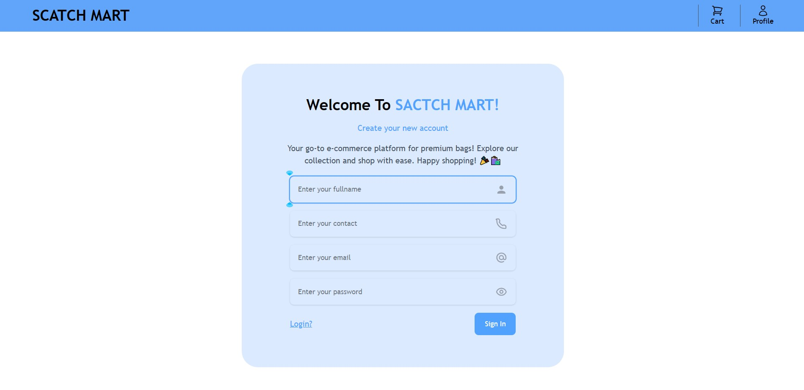
      <p align="center"><em>User Registration</em></p>
    </td>
  </tr>
  <tr>
    <td width="50%">
      
      <p align="center"><em>Password Recovery</em></p>
    </td>
    <td width="50%">
      
      <p align="center"><em>User Profile</em></p>
    </td>
  </tr>
</table>

---

### 🔐 Admin Panel

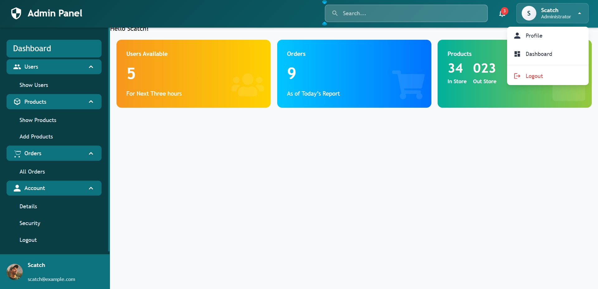
<!-- Add screenshot of admin dashboard -->

*Comprehensive admin dashboard with analytics and user activity tracking*

---

#### Admin Features

<table>
  <tr>
    <td width="50%">
      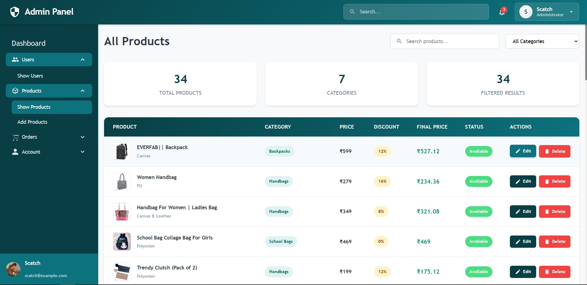
      <p align="center"><em>Product Management</em></p>
    </td>
     <td width="50%">
      
      <p align="center"><em>Analytics Dashboard</em></p>
    </td>
  </tr>
</table>

---

### 🛒 Order Place By User

<table>
  <tr>
    <td width="33%">
      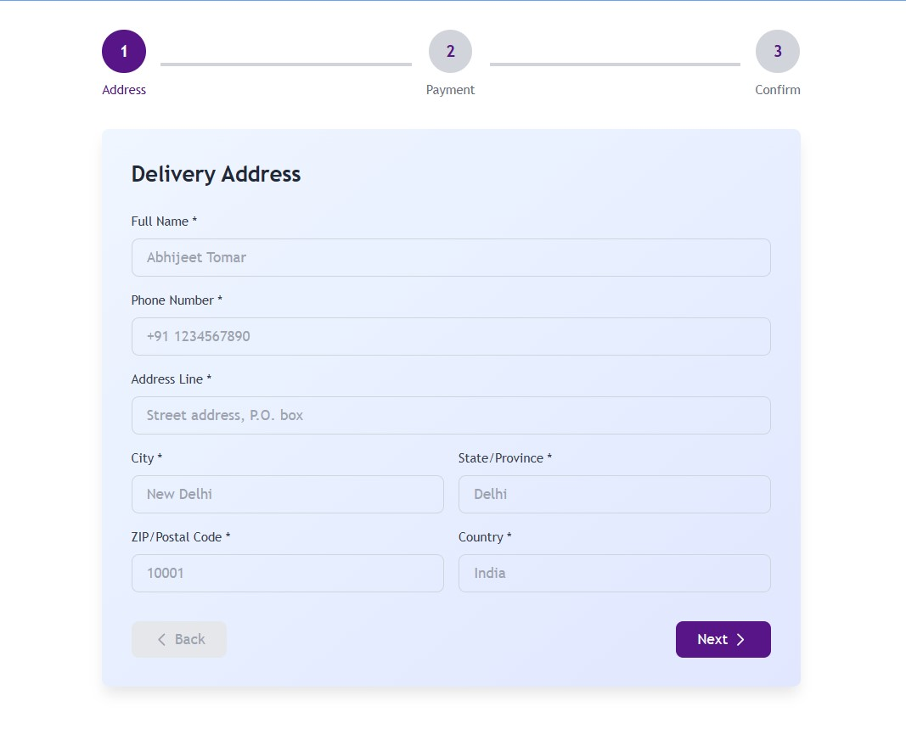
      <p align="center"><em>Fill your Shipping details</em></p>
    </td>
    <td width="33%">
      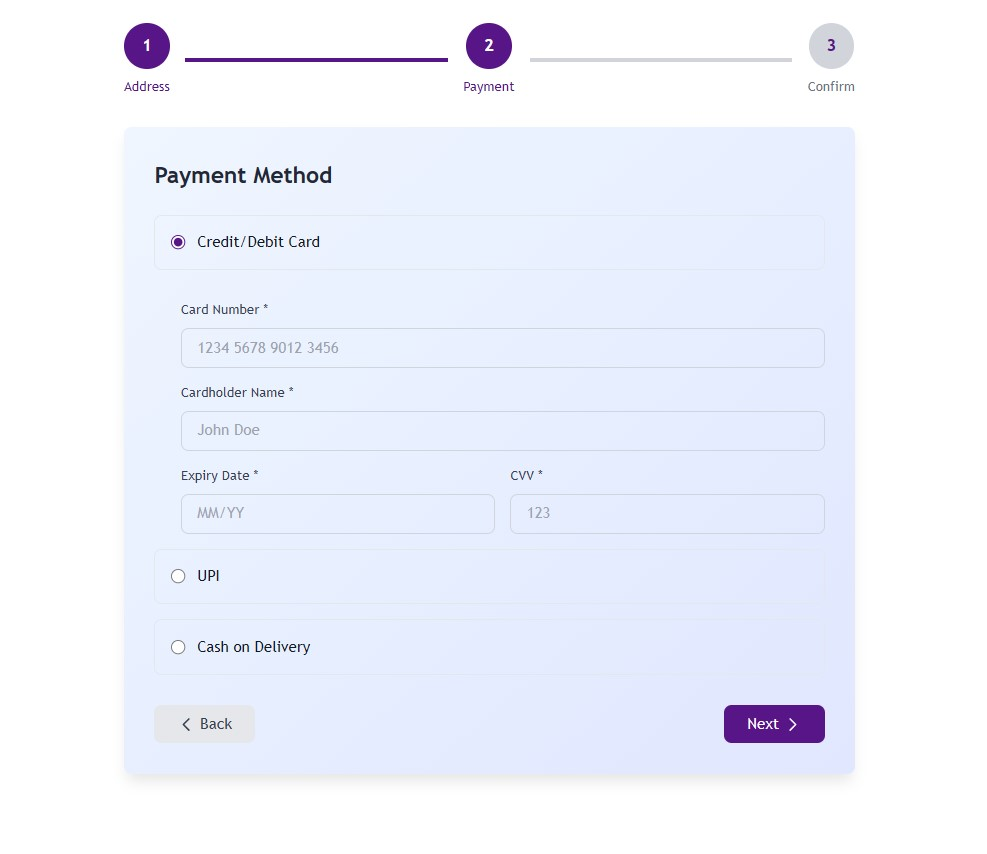
      <p align="center"><em>Choose your Payment Method</em></p>
    </td>
    <td width="33%">
      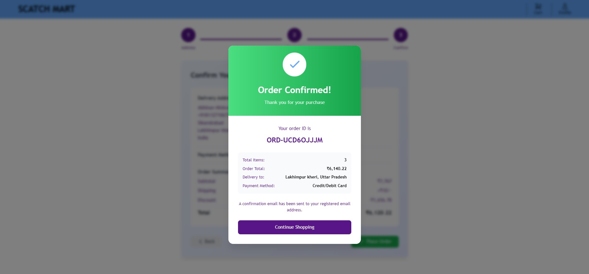
      <p align="center"><em>Order Confirmed</em></p>
    </td>
  </tr>
</table>

*Optimized mobile experience with touch-friendly interface*

---

## ✨ Features

### 🔐 Authentication & Security

- **Secure JWT-based Authentication** with token management
- **User Registration & Login** with comprehensive form validation
- **Password Recovery System** with OTP verification
- **Role-based Access Control** (User/Admin)
- **Session Management** with React Context API
- **Protected Routes** with authentication guards
- **Secure Password Hashing** and validation


<!-- Add authentication flow diagram -->

---

### 🛍️ Product Management

- **Product Catalog** with advanced filtering and search
- **Product Details** with image galleries and specifications
- **Category-based Organization** for easy navigation
- **Related Products** suggestions
- **Product Reviews** and ratings (planned)
- **Real-time Inventory** tracking

---

### 🛒 Shopping Cart

- **Smart Shopping Cart** with dynamic updates
- **Quantity Management** with real-time price calculations
- **Cart Persistence** across sessions
- **Add/Remove Items** with instant feedback
- **Price Summary** with tax and shipping calculations
- **Checkout Process** (payment integration planned)

---

### 👨‍💼 Admin Panel

- **Complete Dashboard** with analytics and insights
- **Product Management** - Add, edit, delete, and view products
- **User Management** - View and manage user accounts
- **Analytics Dashboard** with user activity tracking
- **Role Verification** and access control
- **Bulk Operations** for efficient management

---

### 🎨 UI/UX Features

- **Responsive Design** optimized for all devices
- **Mobile-First Approach** with touch-friendly interface
- **Skeleton Loading** for improved perceived performance
- **Toast Notifications** for user feedback
- **Error Boundaries** for graceful error handling
- **Smooth Transitions** and animations
- **Dark Mode Support** (planned)

---

## 🛠️ Tech Stack

### Frontend

| Technology | Version | Purpose |
|------------|---------|---------|
|  | 19.x | UI Library with concurrent features |
|  | 5.x | Next-generation build tool |
|  | 7.x | Advanced routing with nested routes |
|  | 4.x | Utility-first CSS framework |
|  | 6.x | CSS-in-JS library |
|  | 5.x | React component library |
|  | 1.6.x | HTTP client for API calls |

### State Management

- **React Context API** with `useReducer` pattern
- **Custom Hooks** for API interactions
- **Local Storage/Session Storage** for persistence

### Development Tools

- **ESLint** - Code linting and formatting
- **Vite Dev Server** - Fast development experience
- **Git & GitHub** - Version control and collaboration

### Backend (Separate Repository)

- **Node.js** - Runtime environment
- **Express.js** - Web application framework
- **MongoDB** - NoSQL database
- **Mongoose** - ODM for MongoDB
- **JWT** - Token-based authentication

---

## 🏗️ Architecture

### System Architecture Diagram


<!-- Add system architecture diagram -->

### Frontend Architecture

```
┌─────────────────────────────────────────────────────────┐
│                     React Application                    │
├─────────────────────────────────────────────────────────┤
│  Pages Layer                                             │
│  ├── Home, Login, Product Details, Cart, Admin Panel   │
│                                                           │
│  Components Layer                                        │
│  ├── Shared: Navbar, Footer, SearchBar                  │
│  ├── Product: ProductCard, AddToCart, Filters           │
│  ├── Admin: AdminPanel, AddProduct, UserManagement      │
│  ├── Common: SkeletonLoader, ErrorBoundary              │
│                                                           │
│  State Management Layer (Context API + Reducers)        │
│  ├── AuthContext → authReducer                          │
│  ├── ProductContext → productReducer                    │
│  ├── CartContext → cartReducer                          │
│  ├── AdminContext → adminReducer                        │
│  └── FilterContext → filterReducer                      │
│                                                           │
│  API Layer (Custom Hooks)                               │
│  ├── useAuthApi()                                        │
│  ├── useProductAPI()                                     │
│  ├── useCartApi()                                        │
│  └── useAdminApi()                                       │
│                                                           │
│  Utils Layer                                             │
│  ├── axios.js (HTTP client config)                      │
│  ├── priceFormat.js (Formatting utilities)              │
│  └── ErrorBoundary.jsx (Error handling)                 │
└─────────────────────────────────────────────────────────┘
                          │
                          ▼
                  Backend REST API
```

### State Management Flow


<!-- Add state management flow diagram -->

---

## 🚀 Getting Started

### Prerequisites

Before you begin, ensure you have the following installed:

- **Node.js** (v18 or higher) - [Download](https://nodejs.org/)
- **npm** or **yarn** - Package manager
- **Git** - Version control
- **Backend API** - Running instance of the backend server

### Installation

1. **Clone the Repository**

```bash
git clone https://github.com/EgaleCoder/SCATCH_MART.git
cd SCATCH_MART
```

2. **Install Dependencies**

```bash
npm install
# or
yarn install
```

3. **Configure Environment Variables**

Create a `.env` file in the root directory:

```bash
cp .env.development .env
```

Update the `.env` file with your configuration (see [Environment Variables](#-environment-variables))

4. **Start Development Server**

```bash
npm run dev
# or
yarn dev
```

The application will be available at `http://localhost:5173`

5. **Build for Production**

```bash
npm run build
# or
yarn build
```

### Quick Start with Docker (Optional)

```bash
# Build and run with Docker
docker build -t scatch-mart .
docker run -p 5173:5173 scatch-mart
```

---

## 📁 Project Structure

```
scatch-mart/
├── public/                      # Static assets
│   └── assets/                  # Images, icons, etc.
│
├── src/
│   ├── Components/              # React components
│   │   ├── Admin/              # Admin-specific components
│   │   │   ├── ActiveUser.jsx
│   │   │   ├── AddProduct.jsx
│   │   │   ├── AdminDetails.jsx
│   │   │   ├── AdminNavbar.jsx
│   │   │   ├── AdminPanel.jsx
│   │   │   ├── Home.jsx
│   │   │   ├── ShowProducts.jsx
│   │   │   └── Sidebar.jsx
│   │   │
│   │   ├── Common/             # Shared components
│   │   │   └── SkeletonLoader.jsx
│   │   │
│   │   ├── Home/               # Main user interface
│   │   │   ├── Buttons/
│   │   │   │   ├── Pay.jsx
│   │   │   │   └── ViewCart.jsx
│   │   │   ├── CategoryCard.jsx
│   │   │   ├── Footer.jsx
│   │   │   ├── Navbar.jsx
│   │   │   ├── Profile.jsx
│   │   │   ├── SearchBar.jsx
│   │   │   └── ShowProduct/
│   │   │       ├── AddToCart.jsx
│   │   │       ├── CardLoader.jsx
│   │   │       ├── ConfirmationCard.jsx
│   │   │       ├── FeatureSection.jsx
│   │   │       ├── FillterComponent.jsx
│   │   │       ├── MyImg.jsx
│   │   │       ├── Navigation.jsx
│   │   │       ├── ProductCard.jsx
│   │   │       ├── QuantitySelector.jsx
│   │   │       └── RelatedProducts.jsx
│   │   │
│   │   └── User/
│   │       └── UserProfile.jsx
│   │
│   ├── Pages/                  # Route components
│   │   ├── AdminLogin.jsx
│   │   ├── Cart.jsx
│   │   ├── ForgetPassword.jsx
│   │   ├── Home.jsx
│   │   ├── Login.jsx
│   │   ├── PageNotFound.jsx
│   │   ├── ProductDetails.jsx
│   │   ├── ShowProducts.jsx
│   │   └── Signin.jsx
│   │
│   ├── context/                # React Context providers
│   │   ├── adminContext.jsx
│   │   ├── authContext.jsx
│   │   ├── cartContext.jsx
│   │   ├── fillterContext.jsx
│   │   └── productContext.jsx
│   │
│   ├── Hooks/                  # Custom hooks
│   │   ├── useAdminApi.js
│   │   ├── useAuthApi.js
│   │   ├── useCartApi.js
│   │   └── useProductAPI.js
│   │
│   ├── reducer/                # Reducer functions
│   │   ├── adminReducer.js
│   │   ├── authReducer.js
│   │   ├── cartReducer.js
│   │   ├── fillterReducer.js
│   │   └── productReducer.js
│   │
│   ├── Routes/
│   │   └── ProtectedRoutes.jsx
│   │
│   ├── utils/                  # Utility functions
│   │   ├── axios.js
│   │   ├── ErrorBoundary.jsx
│   │   └── priceFormat.js
│   │
│   ├── App.jsx                 # Main app component
│   ├── main.jsx                # Entry point
│   ├── App.css
│   └── index.css
│
├── docs/                       # Documentation
│   ├── images/                 # Documentation images
│   ├── screenshots/            # Application screenshots
│   └── diagrams/               # Architecture diagrams
│
├── .env.development            # Development environment variables
├── .env.production             # Production environment variables
├── .gitignore
├── eslint.config.js
├── index.html
├── package.json
├── README.md
├── vite.config.js
└── LICENSE
```

---

## 🔧 Environment Variables

Create a `.env` file in the root directory with the following variables:

```env
# API Configuration
VITE_API_BASE_URL=http://localhost:5000/api
VITE_API_TIMEOUT=10000

# Authentication
VITE_JWT_SECRET=your_jwt_secret_key
VITE_JWT_EXPIRY=7d

# Application
VITE_APP_NAME=SCATCH MART
VITE_APP_VERSION=1.0.0
VITE_APP_ENV=development

# Features (Optional)
VITE_ENABLE_ANALYTICS=false
VITE_ENABLE_ERROR_REPORTING=false

# Payment Gateway (Coming Soon)
# VITE_STRIPE_PUBLIC_KEY=your_stripe_public_key
# VITE_RAZORPAY_KEY_ID=your_razorpay_key_id
```

### Environment-specific Configuration

- **Development**: `.env.development`
- **Production**: `.env.production`

---

## 📖 Usage Guide

### For Users

#### 1. Registration & Login

```javascript
// Navigate to signup page
/signup

// Fill registration form with:
- Full Name
- Email Address
- Password (min 8 characters)
- Confirm Password

// After registration, login with credentials
/login
```

#### 2. Browsing Products

- Visit the home page to see featured products
- Use the search bar for specific items
- Apply filters (category, price range, ratings)
- Click on a product card for detailed view

#### 3. Shopping Cart

- Add products to cart from product details page
- Manage quantities in cart
- Review cart before checkout
- Proceed to payment (integration coming soon)

#### 4. User Profile

- Access profile from navbar
- Update personal information
- View order history (coming soon)
- Manage addresses (coming soon)

---

### For Admins

#### 1. Admin Login

```javascript
// Navigate to admin login
/admin/login

// Use admin credentials provided by system administrator
```

#### 2. Product Management

- **Add Product**: Fill product details form with images
- **Edit Product**: Update existing product information
- **Delete Product**: Remove products from catalog
- **View Products**: See all products with management options

#### 3. User Management

- View all registered users
- Monitor user activity
- Manage user roles and permissions

#### 4. Analytics

- View user activity metrics
- Track sales and revenue (coming soon)
- Monitor popular products
- Analyze customer behavior

---

## 📡 API Documentation

### Authentication Endpoints

```javascript
// User Registration
POST /api/auth/register
Body: { name, email, password }

// User Login
POST /api/auth/login
Body: { email, password }
Response: { token, user }

// Password Recovery
POST /api/auth/forgot-password
Body: { email }

// Verify OTP
POST /api/auth/verify-otp
Body: { email, otp }

// Reset Password
POST /api/auth/reset-password
Body: { email, newPassword, token }
```

### Product Endpoints

```javascript
// Get All Products
GET /api/products
Query: ?page=1&limit=10&category=electronics

// Get Single Product
GET /api/products/:id

// Create Product (Admin)
POST /api/products
Headers: { Authorization: Bearer <token> }
Body: { name, description, price, category, images }

// Update Product (Admin)
PUT /api/products/:id
Headers: { Authorization: Bearer <token> }

// Delete Product (Admin)
DELETE /api/products/:id
Headers: { Authorization: Bearer <token> }
```

### Cart Endpoints

```javascript
// Get User Cart
GET /api/cart
Headers: { Authorization: Bearer <token> }

// Add to Cart
POST /api/cart/add
Headers: { Authorization: Bearer <token> }
Body: { productId, quantity }

// Update Cart Item
PUT /api/cart/update/:itemId
Headers: { Authorization: Bearer <token> }
Body: { quantity }

// Remove from Cart
DELETE /api/cart/remove/:itemId
Headers: { Authorization: Bearer <token> }

// Clear Cart
DELETE /api/cart/clear
Headers: { Authorization: Bearer <token> }
```

### Admin Endpoints

```javascript
// Get All Users (Admin)
GET /api/admin/users
Headers: { Authorization: Bearer <admin-token> }

// Get User Activity (Admin)
GET /api/admin/analytics/users
Headers: { Authorization: Bearer <admin-token> }

// Delete User (Admin)
DELETE /api/admin/users/:id
Headers: { Authorization: Bearer <admin-token> }
```

For complete API documentation, visit the [API Docs](https://docs.your-project.com/api)

---

## 🚢 Deployment

### Deploy on Vercel

1. Install Vercel CLI:
```bash
npm install -g vercel
```

2. Deploy:
```bash
vercel
```

3. Configure environment variables in Vercel dashboard

### Deploy on Netlify

1. Build the project:
```bash
npm run build
```

2. Deploy `dist` folder to Netlify

3. Configure environment variables in Netlify dashboard

### Deploy with Docker

```dockerfile
# Dockerfile
FROM node:18-alpine as build
WORKDIR /app
COPY package*.json ./
RUN npm install
COPY . .
RUN npm run build

FROM nginx:alpine
COPY --from=build /app/dist /usr/share/nginx/html
EXPOSE 80
CMD ["nginx", "-g", "daemon off;"]
```

Deploy:
```bash
docker build -t scatch-mart .
docker run -p 80:80 scatch-mart
```

---

## 🗺️ Roadmap

### Phase 1: Core Features ✅ (Completed)

- [x] User authentication and authorization
- [x] Product catalog with filtering
- [x] Shopping cart functionality
- [x] Admin panel with product management
- [x] Responsive design
- [x] Skeleton loading states

### Phase 2: Enhanced Features 🚧 (In Progress)

- [ ] Payment gateway integration (Stripe/Razorpay)
- [ ] Order management system
- [ ] Product reviews and ratings
- [ ] Email notifications
- [ ] Advanced search with autocomplete
- [ ] Wishlist functionality

### Phase 3: Advanced Features 📅 (Planned)

- [ ] Real-time inventory tracking
- [ ] Multi-vendor support
- [ ] Advanced analytics dashboard
- [ ] AI-powered product recommendations
- [ ] PWA features for offline support
- [ ] Multi-language support (i18n)

### Phase 4: Optimization & Scale 🔮 (Future)

- [ ] Microservices architecture
- [ ] WebSocket integration for real-time updates
- [ ] Advanced caching strategies
- [ ] Mobile app (React Native)
- [ ] Performance monitoring
- [ ] A/B testing framework

---

## 🤝 Contributing

Contributions are what make the open-source community such an amazing place to learn, inspire, and create. Any contributions you make are **greatly appreciated**.

### How to Contribute

1. **Fork the Project**
2. **Create your Feature Branch**
   ```bash
   git checkout -b feature/AmazingFeature
   ```
3. **Commit your Changes**
   ```bash
   git commit -m 'Add some AmazingFeature'
   ```
4. **Push to the Branch**
   ```bash
   git push origin feature/AmazingFeature
   ```
5. **Open a Pull Request**

### Contribution Guidelines

- Follow the existing code style and conventions
- Write meaningful commit messages
- Add tests for new features
- Update documentation as needed
- Ensure all tests pass before submitting PR

### Code of Conduct

Please read our [Code of Conduct](CODE_OF_CONDUCT.md) before contributing.

---

## 📜 License

Distributed under the MIT License. See `LICENSE` file for more information.

---

## 📞 Contact

**Abhinav Mishra** - Developer

- GitHub: [@EgaleCoder](https://github.com/EgaleCoder)
- Email: ironabhi728@gmail.com
- LinkedIn: [Abhinav Mishra](https://www.linkedin.com/in/abhinav-mishra-204bb028b)
- Portfolio: [My Portfolio](https://abhinavmishraportfolio.netlify.app/)

**Project Link**: [https://github.com/EgaleCoder/SCATCH_MART](https://scatch-mart.netlify.app/)

---

## 🙏 Acknowledgments

- [React Documentation](https://react.dev/)
- [Vite Documentation](https://vitejs.dev/)
- [Tailwind CSS](https://tailwindcss.com/)
- [Material-UI](https://mui.com/)
- [React Router](https://reactrouter.com/)
- [Axios](https://axios-http.com/)
- [Font Awesome](https://fontawesome.com/) for icons
- All contributors who helped shape this project

---

## 📊 Project Statistics


---

<div align="center">

### ⭐ Star this repository if you find it helpful!

**SCATCH MART** - Where Modern Technology Meets Exceptional Shopping Experience 🛒✨

Made with ❤️ by [Abhinav Mishra](https://github.com/EgaleCoder)

</div>
